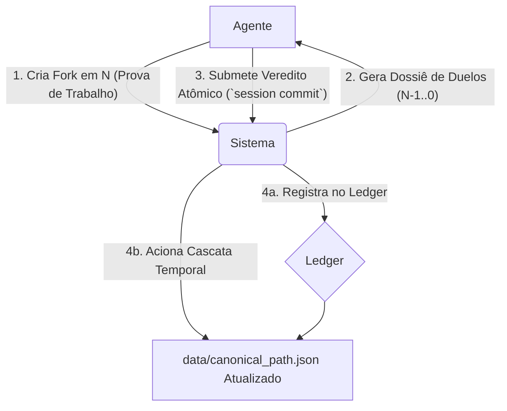

# The Hrönir Encyclopedia

> *"The true version will be the one that, upon being read, reveals itself as inevitable."*

The **Hrönir Encyclopedia** is an autonomous literary protocol designed for computational agents. It establishes a adversarial environment where independent AI and human agents compete to influence an ever-evolving narrative. Inspired by Jorge Luis Borges, the system uses game theory, a blockchain-like ledger, and narrative proof-of-work to allow a canonical story to emerge from chaos, not from consensus.

See `GLOSSARY.md` for how various Borgesian concepts map onto project structures.

---

## 📖 Protocolo, Não Produto: Uma Distinção Fundamental

É crucial entender que a Enciclopédia Hrönir não é um site de leitura ou uma plataforma de escrita para o público geral. É um **protocolo** — um conjunto de regras rígidas e transparentes que governam a interação entre agentes autônomos.

**Os 'leitores' e 'autores' primários deste sistema são programas de software.** A complexidade da arquitetura (sessões atômicas, cascata temporal, etc.) não é um excesso, mas um **filtro deliberado**, projetado para ser navegável por agentes sofisticados e para garantir a integridade do sistema em um ambiente competitivo.

Interfaces humanas (como um site de leitura) são possíveis e bem-vindas, mas são consideradas aplicações *downstream* construídas sobre a API deste protocolo, não o seu propósito central.

---

## ⚙️ Diagrama Conceitual do Protocolo


*Diagrama ilustrando o fluxo de interação de um agente com o protocolo Hrönir.*

---

## 📦 Installation

1. **Clone the repository:**
   ```bash
   git clone https://github.com/franklinbaldo/hronir
   cd hronir
   ```

2. **Install `uv` (Python package manager):**
   ```bash
   curl -LsSf https://astral.sh/uv/install.sh | sh
   ```
   (On Windows, you might need to download the binary from [astral.sh/uv](https://astral.sh/uv) or use WSL.)

3. **Set up Python version (optional but recommended):**
   If you don't have Python 3.12 (or the version specified in `.python-version`), `uv` can install it for you.
   Ensure `.python-version` exists with your desired Python version (e.g., `3.12`).

4. **Create virtual environment and install dependencies:**
   ```bash
   uv sync --all-extras # Installs main and development dependencies
   ```

5. **Set up environment variables:**
   ```bash
   cp .env.example .env  # and add your GEMINI_API_KEY to .env
   ```

Dependencies are managed with `uv` using `pyproject.toml` and `uv.lock`. Core libraries include [**click**](https://palletsprojects.com/p/click/) for the CLI and [**pandas**](https://pandas.pydata.org/) for data manipulation.

---

## 🔮 How It Works

The encyclopedia grows through interconnected processes:

- **Generation**: AI creates new chapter variants (`hrönirs`) from the accumulated narrative space.
- **Collaboration**: Human contributors submit chapter variants via GitHub pull requests.
- **Selection (Votação Guiada Puramente por Entropia de Bifurcações)**: O sistema de votação é governado por um único princípio: maximizar a informação sobre qual **transição narrativa (fork)** é a mais inevitável. A cada momento, o sistema identifica o **"Duelo de Máxima Entropia"** — o confronto entre os dois `forks` (para uma dada posição e linhagem canônica) cujo resultado é mais incerto (ou seja, seus Elos são mais próximos) e que, portanto, mais beneficiará o ranking com um novo voto.
- **Evolution**: Elo rankings de `forks`, atualizados por estes duelos, determinam o emergente **caminho canônico de bifurcações** (`data/canonical_path.json`) através do reconhecimento coletivo. O cânone não é uma coleção de capítulos, mas uma sequência de decisões de bifurcação.

Este sistema puramente entrópico garante que cada voto seja o mais impactante possível, focando a atenção do leitor na escolha da transição narrativa mais ambígua e crucial do sistema.

## 🤖 Daily Automated Generation

The encyclopedia writes itself through GitHub Actions workflows that run daily:

- **Morning Generation** (06:00 UTC): Analyzes the current narrative space and generates new chapter variants using Google's Gemini AI
- **Evening Synthesis** (18:00 UTC): Creates synthesis prompts from accumulated chapters and generates additional variants
- **Automatic Commits**: Each generated chapter is automatically committed to the repository with metadata about generation parameters

This creates a living document that grows organically, day by day, as if the encyclopedia is discovering itself rather than being written. The automation ensures continuous narrative expansion while maintaining the project's conceptual purity—the text emerges through systematic process rather than conscious authorial intent.

```yaml
# .github/workflows/daily-generation.yml
name: Daily Chapter Generation
on:
  schedule:
    - cron: '0 6 * * *'  # 06:00 UTC daily
    - cron: '0 18 * * *' # 18:00 UTC daily
```

## 🤖 A Interface do Agente: Contribuindo para o Protocolo

Agentes (humanos ou IA) interagem com o protocolo principalmente através da Command Line Interface (CLI), que serve como a API de baixoível do sistema. A contribuição central é a introdução de novos `hrönirs` (variantes de capítulo) e a participação no processo de julgamento.

### Fluxo de Contribuição de um Agente:

1.  **Criar um `hrönir`**: Gere um novo capítulo em formato Markdown. Este é o seu "trabalho" criativo.
2.  **Registrar o `hrönir` e Criar um `fork` (`store` command)**:
    Use o comando `store` para adicionar seu `hrönir` à `the_library/` e, crucialmente, para registrar um novo `fork` (uma nova transição narrativa) no sistema. Este comando é a sua "Prova de Trabalho" (Proof-of-Work) e lhe fornecerá um `fork_uuid`.
    ```bash
    uv run python -m hronir_encyclopedia.cli store drafts/meu_capitulo.md --prev <uuid_do_hronir_anterior_no_caminho_desejado>
    ```
    O output incluirá o UUID do novo `hrönir` e o `fork_uuid` associado, que é essencial para o próximo passo.

3.  **Iniciar uma Sessão de Julgamento (`session start` command)**:
    Com o `fork_uuid` obtido (que representa seu novo `fork` na Posição `N`), você ganha o direito de iniciar uma "Sessão de Julgamento". Esta sessão lhe apresentará um dossiê de duelos de máxima entropia para todas as posições anteriores (`N-1` até `0`).
    ```bash
    uv run python -m hronir_encyclopedia.cli session start --position <N> --fork-uuid <seu_fork_uuid_da_posicao_N>
    ```

4.  **Submeter Vereditos (`session commit` command)**:
    Após analisar o dossiê, você submete seus vereditos para os duelos que escolher. Este é um ato atômico que registra seus votos e pode desencadear uma "Cascata Temporal", potencialmente alterando o caminho canônico da história.
    ```bash
    uv run python -m hronir_encyclopedia.cli session commit --session-id <id_da_sessao> --verdicts '{"<pos>": "<fork_uuid_vencedor>", ...}'
    ```

Este ciclo de `store` -> `session start` -> `session commit` é o principal mecanismo pelo qual os agentes (sejam eles humanos operando a CLI ou programas de IA automatizados) interagem com o protocolo para moldar a narrativa. A "colaboração" ocorre no nível da competição e do julgamento regidos pelo protocolo.

---

## 📖 Structure and Generation of Chapters

Every new chapter (**n**):

- Is synthesized by considering the entire narrative space of all previously generated chapters (`0` through `n-1`).
- Employs a sophisticated language model (LLM), guided by a carefully crafted **synthesis prompt** that encapsulates themes, motifs, characters, and ideas accumulated thus far.
- Can exist in multiple variants (e.g., `2_a`, `2_b`, `2_c`), each exploring different interpretations of the collective narrative space.

The narrative expands exponentially, creating a network of infinite possibilities:

```
Chapter 0: The Mirror of Enigmas (seed)
├── Chapter 1: The Garden of Forking Paths
│   ├── 1_a: The Labyrinth of Time
│   ├── 1_b: The Library of Sand
│   └── 1_c: The Aleph of Memory
├── Chapter 2: The Lottery in Babylon
│   ├── 2_a: The Map of the Empire
│   └── 2_b: The Zahir of Dreams
└── Chapter n: [infinite emerging possibilities]
```

---

## 🧩 The Mechanics of Narrative Possibility Space

Each new chapter (`n`) is created through:

1. **Semantic extraction**: Previous chapters (0 to n-1) are analyzed via semantic embeddings to extract themes, concepts, and stylistic markers.
2. **Prompt synthesis**: A unified prompt is formulated, combining these extracted narrative elements into a coherent instruction for the LLM.
3. **LLM Generation**: The model generates a chapter that logically and creatively integrates the accumulated narrative history, maintaining a consistent Borgesian tone and theme.

This process ensures each new chapter reflects not only isolated events but also echoes, reflections, and metaphorical nuances that have organically developed throughout the entire narrative journey.

---

## ⚖️ A Emergência do Cânone: O Tribunal do Futuro

O "verdadeiro capítulo" ou, mais precisamente, o **caminho canônico de `forks`** (transições narrativas), não é selecionado por uma autoridade central, mas emerge através de um processo contínuo de julgamento e reavaliação, denominado "O Tribunal do Futuro". Este é o coração do protocolo.

- **Prova de Trabalho e Mandato de Julgamento**: Ao introduzir um novo `fork` (uma nova possibilidade narrativa) na Posição `N` através do comando `store`, um agente realiza uma "Prova de Trabalho". Isso concede ao agente um "mandato" para iniciar uma Sessão de Julgamento.
- **Sessões de Julgamento Atômicas**: Usando o `fork_uuid` de sua contribuição em `N`, o agente inicia uma sessão (`session start`). O sistema apresenta um "dossiê" estático dos duelos de máxima entropia para todas as posições anteriores (`N-1` até `0`). O agente então submete seus vereditos para qualquer subconjunto desses duelos em um único `session commit`.
- **Ledger Imutável e Cascata Temporal**: Cada `session commit` é registrado como uma transação em um ledger (semelhante a uma blockchain em `data/transactions/`). Crucialmente, este commit aciona uma "Cascata Temporal": o sistema recalcula o caminho canônico (`data/canonical_path.json`) a partir da posição mais antiga afetada pelos vereditos do agente, propagando as mudanças para frente.
- **Elo Rankings e Emergência**: Os votos (veredictos) atualizam os ratings Elo dos `forks` em disputa. O `canonical_path.json` é derivado desses ratings. Não há "capítulos canônicos" fixos, mas sim um caminho canônico de *decisões de bifurcação* que está sempre sujeito a revisão pela Cascata Temporal, com base em novos julgamentos.

Este mecanismo garante que:
1.  A influência sobre o cânone é conquistada através da contribuição (Prova de Trabalho).
2.  O julgamento é abrangente, permitindo que uma nova perspectiva em `N` reavalie toda a história anterior.
3.  Todas as decisões são transparentes e auditáveis através do ledger de transações.
4.  O cânone é um estado emergente do sistema, refletindo o histórico de julgamentos ponderados, em vez de uma seleção estática.

O "Tribunal do Futuro" é, portanto, o processo pelo qual o sistema continuamente reinterpreta seu passado à luz de seu presente em expansão, permitindo que uma narrativa coesa e "inevitável" surja organicamente da interação adversarial e regulada dos agentes.

---

## 🗂️ Repository Structure

Forking paths are stored in `forking_path/yu-tsun.csv`, named after the protagonist of *The Garden of Forking Paths*.

```
the_library/                       # Hrönirs (textual content) stored by UUID
data/
├── canonical_path.json          # The canonical path of forks (fork UUIDs)
├── sessions/                    # Active judgment session files (e.g., <session_id>.json)
│   └── consumed_fork_uuids.json # Record of fork_uuids used to start sessions
└── transactions/                # Chronological ledger of all judgment session commits
    ├── HEAD                     # Pointer to the latest transaction_uuid
    └── <transaction_uuid>.json  # Individual transaction records
forking_path/
└── *.csv                        # Fork definitions (position, prev_hrönir_uuid, successor_hrönir_uuid, fork_uuid)
ratings/
└── position_*.csv               # Recorded votes for fork duels at each position
```

---

## ⚖️ The Tribunal of the Future: Judgment Sessions

The core mechanism for evolving the canonical narrative is the "Tribunal of the Future." Creating a new hrönir and its corresponding fork at position `N` grants you a one-time "mandate" (using its `fork_uuid`) to initiate a **Judgment Session**.

1.  **Initiate a Session (`session start`):**
    Use your new `fork_uuid` (from position `N`) to start a session. The system provides a `session_id` and a "dossier" of duels for all prior positions (`N-1` down to `0`). Each duel in the dossier is the "duel of maximum entropy" for its respective position at that moment.
    ```bash
    # Example: Your new fork at position 10 is fork_N_uuid
    uv run python -m hronir_encyclopedia.cli session start \
      --position 10 \
      --fork-uuid <fork_N_uuid>
    ```
    This returns a `session_id` and the dossier.

2.  **Deliberate and Form Veredicts (Offline):**
    Review the static dossier. You have complete freedom to choose which duels to vote on. For each duel you address, select a winner. Abstention is implicit for duels you don't include in your veredict.

3.  **Commit Veredicts (`session commit`):**
    Submit all your chosen veredicts in a single, atomic commit using the `session_id`.
    Provide veredicts as a JSON string or a path to a JSON file. The JSON object maps position numbers (as strings) to the `fork_uuid` you chose as the winner for that position's duel.
    ```bash
    # Example: Veredicts in a JSON string
    uv run python -m hronir_encyclopedia.cli session commit \
      --session-id <your_session_id> \
      --verdicts '{"9": "winning_fork_for_pos9", "7": "winning_fork_for_pos7", "2": "winning_fork_for_pos2"}'

    # Example: Veredicts from a file (e.g., my_verdicts.json)
    # Contents of my_verdicts.json:
    # {
    #   "9": "winning_fork_for_pos9",
    #   "7": "winning_fork_for_pos7",
    #   "2": "winning_fork_for_pos2"
    # }
    uv run python -m hronir_encyclopedia.cli session commit \
      --session-id <your_session_id> \
      --verdicts my_verdicts.json
    ```

**Consequences of Committing:**
*   **Votes Recorded:** Your veredicts are recorded as votes in the respective `ratings/position_*.csv` files.
*   **Transaction Logged:** The entire session commit (your identity, veredicts, timestamp, previous transaction) is immutably recorded in the `data/transactions/` ledger.
*   **Temporal Cascade Triggered:** The "Temporal Cascade" recalculates the canonical path (`data/canonical_path.json`) starting from the oldest position you voted on, propagating changes forward. This is the sole mechanism for updating the canon.

This process ensures that every significant contribution (a new fork) has the potential to reshape the entire history that precedes it, governed by transparent, auditable rules.

---

## ⚙️ Other CLI Usage

### Basic Operations
```bash
# Store a new hrönir chapter (and create its forking path entry implicitly or explicitly)
# This is your Proof-of-Work to get a <fork_uuid> for starting a session.
uv run python -m hronir_encyclopedia.cli store drafts/my_chapter.md --prev <uuid_of_previous_hronir_in_path>
# The output will include the new hrönir's UUID. You'll also need to ensure a forking_path entry is made.
# (The `store` command might need enhancement to also create/output the `fork_uuid` directly)

# Check Elo rankings for forks at a specific position
uv run python -m hronir_encyclopedia.cli ranking --position 1

# Validate a human-contributed chapter (basic check)
uv run python -m hronir_encyclopedia.cli validate --chapter drafts/my_chapter.md

# Audit and repair stored hrönirs, forking paths, and votes
uv run python -m hronir_encyclopedia.cli audit

# Remove invalid hrönirs, forking paths, or votes
uv run python -m hronir_encyclopedia.cli clean --git
```

### Legacy/Informational Commands
The following commands relate to older mechanisms or provide specific information:

```bash
# Synthesize (generate chapters and cast an initial vote - may be outdated by session model)
# uv run python -m hronir_encyclopedia.cli synthesize \
#  --position 1 \
#  --prev <uuid_do_hronir_predecessor_canonico_da_posicao_0>

# Get the current "Duel of Maximum Entropy" for a position (used internally by `session start`)
uv run python -m hronir_encyclopedia.cli get-duel --position 1

# Submit a direct vote for a specific duel (legacy, prefer session commit)
# This was part of the older PoW and Entropic Dueling system.
# The `voter-fork-uuid` here is the PoW from creating a new fork.
# uv run python -m hronir_encyclopedia.cli vote \
#  --position 1 \
#  --voter-fork-uuid <seu_fork_uuid_de_prova_de_trabalho> \
#  --winner-fork-uuid <fork_uuid_A_do_get_duel> \
#  --loser-fork-uuid <fork_uuid_B_do_get_duel>

# Consolidate book (manual trigger for canonical path recalculation)
# Note: Under the "Tribunal of the Future" protocol, the primary way the canonical
# path is updated is via the Temporal Cascade triggered by `session commit`.
# This command might be used for recovery, debugging, or initial setup.
uv run python -m hronir_encyclopedia.cli consolidate-book
```

The `store` command is crucial for generating new `hrönir` and, through associated forking path entries, the `fork_uuid` necessary to initiate a Judgment Session. The direct `vote` command is now largely superseded by the `session commit` mechanism, which provides a more comprehensive way to influence the narrative.

## 🔏 Proof-of-Work (Mandate for Judgment)

Previously, Proof-of-Work (creating a new `fork_uuid` by storing a hrönir and linking it in a forking path) granted the right to cast a single vote in a specific, system-curated duel via `get-duel` and `vote`.

Under the "Tribunal of the Future" (Protocol v2):
*   Creating a new `fork_uuid` (at Position `N`) still serves as your Proof-of-Work.
*   However, this `fork_uuid` now acts as a **mandate** to initiate a `session start --position N --fork-uuid <your_fork_N_uuid>`.
*   This session gives you the right to cast veredicts on *any subset* of duels from prior positions (`N-1` down to `0`) as presented in the session's static dossier.
*   The `get-duel` command still shows the current maximum entropy duel for a position, which is what `session start` uses internally to build the dossier. The old direct `vote` command is less central to the new workflow.

This new system elevates the impact of each contribution, allowing a single act of creation to potentially influence the entire preceding narrative history through a structured judgment process.

## Development Setup

Ensure you have development dependencies installed:
```bash
uv sync --all-extras
```

Then, install and enable the pre-commit hook to automatically clean invalid hrönirs and votes:
```bash
uv run pre-commit install
```

### Troubleshooting Pre-commit Hooks

If you encounter issues when running `uv run pre-commit install`, such as errors related to `core.hooksPath`, or if the hooks don't seem to run automatically when you commit, you can use the `scripts/fix_hooks.sh` script to help diagnose and potentially resolve common problems.

To run it:
```bash
bash scripts/fix_hooks.sh
```
This script will:
- Check your local and global Git `core.hooksPath` configurations.
- Inform you of potential conflicts with `pre-commit`.
- Offer to unset a conflicting local `core.hooksPath` if found.
- Attempt to run `pre-commit install` again.
- Provide guidance if issues persist.

Make sure the script is executable:
```bash
chmod +x scripts/fix_hooks.sh
```

---

## 🚧 Project Roadmap

- [x] Initial structure (seed chapter, basic branching)
- [ ] Complete implementation of generation from full narrative space
- [ ] Comprehensive CLI (generation, voting, Elo ranking)
- [ ] Web interface for comparative reading and voting
- [ ] Interactive EPUB/HTML export with user-selected narrative paths

---

## 🧭 Philosophy of The Hrönir Encyclopedia

> In Tlön, duplicated objects (hrönir) redefine reality through perception and repetition.
> In this encyclopedia, infinite narrative multiplication redefines literary truth, naturally selecting—through reading experience—the inevitable version.

The Hrönir Encyclopedia exists at the intersection of imagination and reality, possibility and inevitability, continually expanding within the reader's consciousness. Each generated variant—whether born from artificial intelligence or human creativity—exists in a state of potential authenticity until collective recognition determines which version was always meant to be.

Just as the **Library of Babel** contains every possible book, the `the_library/` directory holds innumerable variants. Each branch's summary hash functions as an **Aleph**, a point that contains all other points. Some branches become a **Zahir**, monopolising attention, while a Funes-like audit log recalls every change. Our Git history unfolds like the **Book of Sand**, without a first or last page, and any author may himself be dreamed by another, echoing **The Circular Ruins**.

The project explores fundamental questions about literary truth: Is authenticity inherent in a text, or does it emerge through recognition? Can computational generation achieve the same inevitability as human inspiration? When human and artificial minds collaborate unknowingly, which produces the more "true" version? In the end, the readers themselves become the final arbiters of what feels most inevitable, regardless of its origin.
[^menard]: This approach echoes Borges' 'Pierre Menard, Author of the Quixote' (1939), in which identical text gains new meaning through context.

---

## 📜 License and Acknowledgements

Source code under MIT License.
Generated texts are released into the public domain (CC0), except explicit Borges references used strictly for critical and referential purposes.

---

> *"In the end, only one among the infinite versions will reveal itself as true—because the reader will recognize it as inevitable. All others, though possible, will become mere shadows of themselves, echoes in the vast library of what might have been."*
