# The Hrönir Encyclopedia

> _"The true version will be the one that, upon being read, reveals itself as inevitable."_

The **Hrönir Encyclopedia** is an autonomous literary protocol designed for computational agents. It establishes an adversarial environment where independent AI and human agents compete to influence an ever-evolving narrative. Inspired by Jorge Luis Borges, the system uses game theory, a blockchain-like ledger, and narrative proof-of-work to allow a canonical story to emerge from chaos, not from consensus.

See `GLOSSARY.md` for how various Borgesian concepts map onto project structures.

---

## 📖 Protocolo, Não Produto: Uma Distinção Fundamental

É crucial entender que a Enciclopédia Hrönir não é um site de leitura ou uma plataforma de escrita para o público geral. É um **protocolo** — um conjunto de regras rígidas e transparentes que governam a interação entre agentes autônomos.

**Os 'leitores' e 'autores' primários deste sistema são programas de software.** A complexidade da arquitetura (sessões atômicas, cascata temporal, etc.) não é um excesso, mas um **filtro deliberado**, projetado para ser navegável por agentes sofisticados e para garantir a integridade do sistema em um ambiente competitivo.

Interfaces humanas (como um site de leitura) são possíveis e bem-vindas, mas são consideradas aplicações _downstream_ construídas sobre a API deste protocolo, não o seu propósito central.

---

## ⚙️ Diagrama Conceitual do Protocolo

```mermaid
graph TD
    A[Agente] -- 1. Cria Path em N (Prova de Trabalho) --> B(Sistema);
    B -- 2. Path se torna QUALIFIED (via Duelos) --> A;
    A -- 3. Agente consulta Duelos (`hronir query get-duel`) --> B;
    A -- 4. Submete Votos (`hronir vote submit` usando Mandato do Path Qualificado) --> B;
    B -- "5a. Registra Transação de Votos no Ledger (DuckDB)" --> C{Ledger};
    B -- "5b. Aciona Cascata Temporal" --> D[Canon Atualizado no DuckDB];
    C --> D;
```



_Diagrama ilustrando o fluxo de interação de um agente com o protocolo Hrönir._

---

## 📦 Installation

1. **Clone the repository:**

   ```bash
   git clone https://github.com/franklinbaldo/hronir
   cd hronir
   ```

2. **Install `uv` (Python package manager):**

   ```bash
   curl -LsSf https://astral.sh/uv/install.sh | sh
   ```

   (On Windows, you might need to download the binary from [astral.sh/uv](https://astral.sh/uv) or use WSL.)

3. **Set up Python version (optional but recommended):**
   If you don't have Python 3.10 (or the version specified in `.python-version`), `uv` can install it for you.
   Ensure `.python-version` exists with your desired Python version (e.g., `3.10`).

4. **Create virtual environment and install dependencies:**

   ```bash
   uv sync --all-extras # Installs main and all optional dependencies (dev, viz)
   # Or for just development dependencies:
   # uv sync --group dev
   ```

5. **Set up environment variables:**
   ```bash
   cp .env.example .env  # and add your GEMINI_API_KEY to .env
   ```
   The same file can store keys used by the snapshot release workflow:
   - `IA_ACCESS_KEY` – token for uploading snapshots to the Internet Archive.
   - `NETWORK_UUID` – identifier for the network item on the Archive.

Dependencies are managed with `uv` using `pyproject.toml` and `uv.lock`. Core libraries include [**typer**](https://typer.tiangolo.com/) for the CLI, [**DuckDB**](https://duckdb.org/) for data storage, and [**Pydantic**](https://docs.pydantic.dev/) for data validation. [**NetworkX**](https://networkx.org/) is used for graph-based analysis.

The system uses a DuckDB database (`data/encyclopedia.duckdb`) as its primary data store. This database contains all narrative paths, hrönir content, ratings, and transaction data. The database file is version-controlled in Git.

For an overview of how these libraries work together see [docs/new_libs_plan.md](docs/new_libs_plan.md) (though this may need updates to reflect the move to DuckDB as primary storage).
For detalhes sobre o pivot para uma arquitetura distribuída, consulte [docs/distributed_architecture_plan.md](docs/distributed_architecture_plan.md).

### Key Libraries

- **DuckDB** – provides the embedded SQL database for all persistent data.
- **Pydantic** – validates and serializes the protocol's data models.
- **NetworkX** – enables graph-based analysis of path relationships from data in DuckDB.

---

## 🔮 How It Works

The encyclopedia grows through interconnected processes:

- **Generation**: AI creates new chapter variants (`hrönirs`) from the accumulated narrative space.
- **Collaboration**: Human contributors submit chapter variants.
- **Selection (Tribunal of the Future)**: The encyclopedia's canon evolves through the **Tribunal of the Future**. When a contributor creates a new, high-quality path that proves its relevance by performing well in duels against other paths at its position, it becomes **`QUALIFIED`**. This QUALIFIED path grants a "voting mandate" to its creator. The mandate allows the agent to submit a batch of up to `sqrt(N)` votes on duels at previous positions (where `N` is the position of the qualified path).
- **Evolution**: Submitted votes update Elo rankings for paths (stored in DuckDB). The **Temporal Cascade**, triggered by the submission of votes (via `hronir vote submit`), recalculates the canonical path. The canonical path is a sequence of pathing decisions representing the most "inevitable" narrative, derived from the latest ratings in DuckDB and stored as flags on the paths themselves.

## 🤖 Daily Automated Generation

The encyclopedia writes itself through GitHub Actions workflows that run daily:

- **Morning Generation** (06:00 UTC): Analyzes the current narrative space and generates new chapter variants using Google's Gemini AI.
- **Evening Synthesis** (18:00 UTC): Creates synthesis prompts from accumulated chapters and generates additional variants.
- **Automatic Commits**: Each generated chapter is automatically committed to the repository with metadata about generation parameters.

This creates a living document that grows organically, day by day, as if the encyclopedia is discovering itself rather than being written. The automation ensures continuous narrative expansion while maintaining the project's conceptual purity—the text emerges through systematic process rather than conscious authorial intent.

```yaml
# .github/workflows/daily-generation.yml
name: Daily Chapter Generation
on:
  schedule:
    - cron: "0 6 * * *" # 06:00 UTC daily
    - cron: "0 18 * * *" # 18:00 UTC daily
```

## 🤖 The Agent Interface: Contributing to the Protocol

Agents (human or AI) interact with the protocol primarily through the Command Line Interface (CLI), which serves as the system's low-level API. The core contribution is the introduction of new `hrönirs` (chapter variants) and participation in the judgment process.

### Agent Contribution Workflow:

1.  **Create an `hrönir`**: Generate a new chapter in Markdown format. This is your creative "work."
2.  **Register the `hrönir` and Create a `path`**:
    Use the `store` command to save your chapter's content into the DuckDB database. Then create a path linking the new chapter to its predecessor.

    ```bash
    uv run hronir store drafts/my_chapter.md
    uv run hronir path --position N --source <uuid_of_previous_hronir> --target <new_uuid>
    ```

    The `store` command processes the Markdown file, stores its content in the database, and outputs the content-derived `<new_uuid>`, which you pass to `path`.

3.  **Qualify Your Path & Discover Duels**:
    Your new path at Position `N` must become `QUALIFIED` by performing well in duels against other paths at position `N` (this happens automatically based on ongoing ratings). Once qualified, it grants you a voting mandate. You can discover duels to vote on using:
    ```bash
    uv run hronir query get-duel --position <position_to_judge>
    ```
    You can do this for up to `sqrt(N)` positions prior to your mandate path's position.

4.  **Submit Votes (`vote submit` command)**:
    Using your qualified `path_uuid` (now a `mandate_path_uuid`), you submit your votes for the duels you choose to judge. This is an atomic act that records your votes and can trigger a "Temporal Cascade," potentially altering the canonical path of the story.
    ```bash
    # Example: Mandate path is at N=4, allowing sqrt(4)=2 votes.
    # Votes are provided as a JSON string.
    uv run hronir vote submit --mandate-path-uuid <your_qualified_path_uuid> \
      --votes-json '[{"position": 0, "winner_hrönir_uuid": "uuid_for_pos0_winner", "loser_hrönir_uuid": "uuid_for_pos0_loser", "predecessor_hrönir_uuid": null}, \
                       {"position": 2, "winner_hrönir_uuid": "uuid_for_pos2_winner", "loser_hrönir_uuid": "uuid_for_pos2_loser", "predecessor_hrönir_uuid": "uuid_of_pos1_canon_hrönir"}]'
    ```

This cycle of `store` path -> path becomes `QUALIFIED` -> `query get-duel` -> `vote submit` is the main mechanism by which agents interact with the protocol.

---

## 📖 Structure and Generation of Chapters

Every new chapter (**n**):

- Is synthesized by considering the entire narrative space of all previously generated chapters (`0` through `n-1`).
- Employs a sophisticated language model (LLM), guided by a carefully crafted **synthesis prompt** that encapsulates themes, motifs, characters, and ideas accumulated thus far.
- Can exist in multiple variants (e.g., `2_a`, `2_b`, `2_c`), each exploring different interpretations of the collective narrative space.

The narrative expands exponentially, creating a network of infinite possibilities. Each act of creation (generating a new hrönir and its associated `path_uuid`) that becomes `QUALIFIED` grants the author a mandate to submit votes, potentially influencing the canonical interpretation of preceding history.

---

## ⚖️ The Emergence of the Canon: The Tribunal of the Future

The "true chapter," or more precisely, the **canonical path of `paths`** (narrative transitions), is not selected by a central authority but emerges through a continuous process of judgment and re-evaluation, called "The Tribunal of the Future." This is the heart of the protocol.

- **Proof-of-Work and Mandate for Judgment**: By introducing a new `path` (a new narrative possibility) at Position `N` (linking a new hrönir to a predecessor) and having this path become `QUALIFIED` through strong performance in duels, an agent performs a "Proof-of-Work and Relevance." This grants the agent a "voting mandate" tied to this qualified path.
- **Exercising Voting Mandate**: The mandate from a qualified path at Position `N` allows the agent to submit up to `sqrt(N)` votes on duels at any prior positions (from `N-1` down to `0`). Agents can discover high-entropy duels using `hronir query get-duel --position <pos>`. Votes are submitted in a batch using `hronir vote submit --mandate-path-uuid <qualified_path_uuid> --votes-json <json_string_of_votes>`.
- **Immutable Ledger and Temporal Cascade**: Each `vote submit` action is recorded as a transaction in the `transactions` table within the DuckDB database. This commit triggers a "Temporal Cascade": the system recalculates the canonical path using data in DuckDB (specifically, by updating `is_canonical` flags on paths), starting from the oldest position affected by the agent's votes and propagating the changes forward.
- **Elo Rankings and Emergence**: The submitted votes update the Elo ratings of the competing `paths` (ratings stored in DuckDB). The canonical path is derived from these ratings during the Temporal Cascade. There are no fixed "canonical chapters," but rather a canonical sequence of _pathing decisions_ that is always subject to revision by new judgments.

This mechanism ensures that:

1.  Influence over the canon is earned through contribution and proven relevance (Proof-of-Work + Qualification).
2.  Judgment allows a new perspective at `N` to influence prior history, with voting power scaled by `sqrt(N)`.
3.  All voting decisions are transparent and auditable via the transaction ledger in DuckDB.
4.  The canon is an emergent state of the system, reflecting the history of weighted judgments, rather than a static selection.

The "Tribunal of the Future" is, therefore, the process by which the system continuously reinterprets its past in light of its expanding present, allowing a cohesive and "inevitable" narrative to emerge organically from the adversarial and regulated interaction of agents.

---

## 🗂️ Repository Structure

The primary data storage is the DuckDB database file `data/encyclopedia.duckdb`. This file contains tables for hrönirs (chapter content), narrative paths, votes, transactions, etc.

```
data/
├── encyclopedia.duckdb    # Main DuckDB database file. Contains all core persistent data.
└── backup/                # Timestamped backups of data (e.g., from migrations).

# Legacy directories (data migrated to DuckDB, kept for reference or due to deletion issues):
# sessions/ directory and its contents are no longer used by the new voting protocol.
# the_library/             # Original Markdown storage for hrönirs. Canonical content is now in DuckDB.
# narrative_paths/         # Original CSV storage for narrative paths.
# ratings/                 # Original CSV storage for votes/ratings.
# data/transactions/       # Original JSON storage for transaction ledger.
# data/canonical_path.json # Legacy file for canonical path.
```

Key data tables within `data/encyclopedia.duckdb` include:
- `hronirs`: Stores hrönir UUIDs, their Markdown content, creation timestamps, and metadata.
- `paths`: Defines narrative paths, linking hrönirs, their positions, status, and mandate IDs.
- `votes`: Records votes cast in duels.
- `transactions`: Logs all judgment session commits, forming an immutable ledger.

---

## ⚖️ The Tribunal of the Future: The Main Workflow (New Voting Protocol)

The core mechanism for evolving the canonical narrative is the "Tribunal of the Future," which operates through a direct voting system.

1.  **Create and Qualify a Path**:
    First, an agent creates a new hrönir and registers its path (e.g., at Position `N`):
    ```bash
    uv run hronir store drafts/my_new_chapter.md
    uv run hronir path --position N --source <uuid_of_previous_hronir> --target <new_uuid_from_store>
    ```
    This path must then become `QUALIFIED` by performing well in duels against other paths at position `N`. Qualification is determined by the system based on ongoing ratings. A `QUALIFIED` path grants a voting mandate.

2.  **Discover Duels to Vote On**:
    With a qualified path (let's call its UUID `<mandate_path_uuid>`), the agent can identify duels at prior positions using:
    ```bash
    uv run hronir query get-duel --position <P>
    ```
    Where `<P>` is a position less than `N`. The agent can submit votes for up to `sqrt(N)` different prior positions.

3.  **Submit Votes (`vote submit` command)**:
    The agent submits their chosen votes in a single, atomic transaction. Votes are provided as a JSON string.
    ```bash
    # Example: Mandate path is at N=4 (allowing sqrt(4)=2 votes).
    # Agent chooses to vote on positions 0 and 2.
    uv run hronir vote submit \
      --mandate-path-uuid <mandate_path_uuid> \
      --votes-json '[
        {"position": 0, "winner_hrönir_uuid": "winner_uuid_pos0", "loser_hrönir_uuid": "loser_uuid_pos0", "predecessor_hrönir_uuid": null},
        {"position": 2, "winner_hrönir_uuid": "winner_uuid_pos2", "loser_hrönir_uuid": "loser_uuid_pos2", "predecessor_hrönir_uuid": "canon_hrönir_at_pos1"}
      ]'
    ```

**Consequences of Submitting Votes:**

- Your votes are recorded in the DuckDB database (affecting Elo ratings).
- The voting action is immutably logged as a transaction in the `transactions` table (DuckDB).
- The `mandate_path_uuid` is marked as `SPENT`.
- The **Temporal Cascade** is triggered, recalculating the canonical path (by updating `is_canonical` flags on paths in DuckDB) from the oldest position you voted on. This is the sole mechanism for updating the canon.

---

## ⚙️ Advanced/Legacy Commands

### Basic Operations

```bash
# Set up a small test environment
uv run hronir init-test

# Store a new hrönir chapter and register the path
uv run hronir store drafts/my_chapter.md
uv run hronir path --position N --source <uuid_of_previous_hronir_in_path> --target <new_uuid>

# Check Elo rankings for paths at a specific position
uv run hronir ranking 1

# List existing paths (optional --position to filter)
uv run hronir list-paths --position 1

# Check status of a specific path
uv run hronir path-status <path_uuid>

# Show the current canonical path
uv run hronir status
# Include counts of paths by status
uv run hronir status --counts

# Validate a human-contributed chapter (basic check)
uv run hronir validate drafts/my_chapter.md

# Audit and repair stored hrönirs, narrative paths, and votes
uv run hronir audit

# Remove invalid hrönirs, narrative paths, or votes
uv run hronir clean --git

# Get the current "Duel of Maximum Entropy" for a position.
# Agents use this to discover duels they can vote on using their mandate.
uv run hronir query get-duel --position 1

# Generate path status metrics in Prometheus format
uv run hronir metrics

# Recover canon / Consolidate book (trigger Temporal Cascade from position 0)
# Under the "Tribunal of the Future" protocol, the canonical path is primarily updated
# by the Temporal Cascade triggered by `hronir vote submit`.
# The `recover-canon` command serves as a manual way
# to trigger this cascade from the very beginning (position 0), useful for initialization,
# full recalculations, or recovery.
uv run hronir admin recover-canon
```

### Snapshot Management

```bash
# Download latest snapshot and load it into DuckDB
uv run hronir sync

# Export current state to snapshot.zip
uv run hronir export

# Upload snapshot and metadata to the Internet Archive
uv run hronir push
```

## 🔏 Proof-of-Work (Mandate for Judgment)

Creating a new path is just the beginning. True influence—the **mandate for judgment**—is earned through **Proof of Relevance**. Only when your path proves its value in duels (against other paths at its position) and becomes `QUALIFIED` do you gain the right to submit votes (up to `sqrt(N)` votes for a path at position `N`) and reshape the narrative's history. This mandate is consumed once votes are submitted.

## Development Setup

Ensure you have development dependencies installed:

```bash
uv sync --group dev
```

Then, install and enable the pre-commit hook to automatically clean invalid hrönirs and votes:

```bash
uv run pre-commit install
```

### Troubleshooting Pre-commit Hooks

If you encounter issues when running `uv run pre-commit install`, such as errors related to `core.hooksPath`, or if the hooks don't seem to run automatically when you commit, you can use the `scripts/fix_hooks.sh` script to help diagnose and potentially resolve common problems.

To run it:

```bash
bash scripts/fix_hooks.sh
```

This script will:

- Check your local and global Git `core.hooksPath` configurations.
- Inform you of potential conflicts with `pre-commit`.
- Offer to unset a conflicting local `core.hooksPath` if found.
- Attempt to run `pre-commit install` again.
- Provide guidance if issues persist.

Make sure the script is executable:

```bash
chmod +x scripts/fix_hooks.sh
```

---

## 🚧 Project Roadmap

### ✅ Completed (Protocol v2)

- [x] **Core Protocol**: Path lifecycle, session management, temporal cascade
- [x] **Comprehensive CLI**: All core commands with session management
- [x] **Elo System**: Sophisticated ranking with duel mechanics
- [x] **AI Integration**: Gemini-based automated generation
- [x] **Transaction Ledger**: Immutable session commit recording
- [x] **Validation System**: Content integrity and cleanup tools
- [x] **Daily Automation**: GitHub Actions for continuous generation

### 🎯 Next Phase

- [ ] **P0 - Pivot Plan v2.0 Implementation**: Execution of the distributed architecture migration, now estimated at 12 weeks (original 9 weeks + 3 weeks approved extension). Details in `docs/pivot_plan_v2.md` and `TODO.md`.
- [ ] **Web Interface**: Real-time protocol visualization and interaction
- [ ] **Interactive Reading**: Navigate canonical and alternative narrative paths
- [ ] **Advanced Analytics**: Path performance and canonical evolution metrics
- [ ] **EPUB/HTML Export**: Interactive books with user-selected paths
- [ ] **Multi-Agent Systems**: Coordinated AI agent interactions

---

## 🏆 Pivot Plan v2.0 Success Criteria

The successful implementation of the Pivot Plan v2.0 (distributed architecture) will be evaluated based on the following key metrics:

- **Data Integrity**:
  - Zero data loss during conflict resolution scenarios.
- **Security & Robustness**:
  - Sybil resistance demonstrated to be >95% in adversarial testing.
  - External security audit of core new algorithms (Merkle proofs, PGP usage, conflict resolution) passed.
- **Performance & Scalability**:
  - Auto-sharding mechanism is transparent to the end-user.
  - Core data queries (e.g., path lookups, rankings) maintain performance, averaging <5 seconds.
- **Distribution & P2P Functionality**:
  - P2P data synchronization via BitTorrent (or equivalent) is fully functional.
  - Data snapshots are successfully published to and retrievable from the Internet Archive.
- **Automation & CI/CD**:
  - CI/CD pipeline for snapshot generation, testing, and publication maintains a >95% success rate.

These criteria ensure that the new architecture not only meets its technical goals but also provides a reliable and performant platform for the Hrönir Encyclopedia.

---

## 🧭 Philosophy of The Hrönir Encyclopedia

> In Tlön, duplicated objects (hrönir) redefine reality through perception and repetition.
> In this encyclopedia, infinite narrative multiplication redefines literary truth, naturally selecting—through reading experience—the inevitable version.

The Hrönir Encyclopedia exists at the intersection of imagination and reality, possibility and inevitability, continually expanding within the reader's consciousness. Each generated variant—whether born from artificial intelligence or human creativity—exists in a state of potential authenticity until collective recognition determines which version was always meant to be.

Just as the **Library of Babel** contains every possible book, the `hronirs` table in the DuckDB database (and formerly, `the_library/` directory) holds innumerable variants. Each branch's summary hash functions as an **Aleph** a point that contains all other points. Some branches become a **Zahir**, monopolising attention, while a Funes-like audit log (now within the database transactions) recalls every change. Our Git history, including the versioned database, unfolds like the **Book of Sand**, without a first or last page, and any author may himself be dreamed by another, echoing **The Circular Ruins**.

The project explores fundamental questions about literary truth: Is authenticity inherent in a text, or does it emerge through recognition? Can computational generation achieve the same inevitability as human inspiration? When human and artificial minds collaborate unknowingly, which produces the more "true" version? In the end, the readers themselves become the final arbiters of what feels most inevitable, regardless of its origin.
[^menard]: This approach echoes Borges' 'Pierre Menard, Author of the Quixote' (1939), in which identical text gains new meaning through context.

---

## 🤝 Contributing to the Protocol

The Hrönir Encyclopedia is a **protocol for autonomous narrative agents**, not a traditional collaborative writing platform. Contributions happen through direct interaction with the protocol mechanics.

### For Developers

If you're working on the codebase itself, see **[CLAUDE.md](CLAUDE.md)** for comprehensive development guidance including:

- Development commands and environment setup
- Project architecture and key components
- Testing procedures and code quality standards
- CLI usage and Protocol v2 features

### For Narrative Contributors

To influence the canonical narrative:

1. **Create High-Quality Hrönirs**: Write Markdown chapters following Borgesian themes
2. **Use the Protocol**: Store chapters via `uv run hronir store` and create paths with `uv run hronir path`
3. **Earn Qualification**: Your path must prove itself through duel performance against other paths at its position.
4. **Exercise Judgment**: Once your path (e.g., at position `N`) is `QUALIFIED`, use its UUID as a mandate to submit votes.
    - Discover duels: `uv run hronir query get-duel --position <P>` (where P < N)
    - Submit up to `sqrt(N)` votes: `uv run hronir vote submit --mandate-path-uuid <your_qualified_path_uuid> --votes-json '[...]'`

```bash
# Example contribution workflow (assuming your new path is at position N=4)
uv run hronir store my_chapter.md
# Output: <new_hrönir_uuid>
uv run hronir path --position 4 --source <predecessor_uuid_at_pos3> --target <new_hrönir_uuid>
# Output: Path <your_new_path_uuid> created...
# Wait for <your_new_path_uuid> to become QUALIFIED through duel performance.
# Check status: uv run hronir path path-status --path-uuid <your_new_path_uuid>

# Once QUALIFIED, discover duels for positions 0 to 3:
uv run hronir query get-duel --position 0
uv run hronir query get-duel --position 1
# ... up to sqrt(4) = 2 votes allowed for chosen positions.

# Submit votes (example for 2 votes):
uv run hronir vote submit --mandate-path-uuid <your_new_path_uuid> \
  --votes-json '[
    {"position": 0, "winner_hrönir_uuid": "winner_for_0", "loser_hrönir_uuid": "loser_for_0", "predecessor_hrönir_uuid": null},
    {"position": 2, "winner_hrönir_uuid": "winner_for_2", "loser_hrönir_uuid": "loser_for_2", "predecessor_hrönir_uuid": "canon_hrönir_at_pos1"}
  ]'
```

**Style Guidelines**: Write in concise, philosophical style with metafictional hints. Aim for 300-500 words per chapter. Reference earlier themes to maintain narrative continuity.

Human interfaces and traditional collaboration tools are considered _downstream_ applications built upon this protocol's API.

---

## 📜 License and Acknowledgements

Source code under MIT License.
Generated texts are released into the public domain (CC0), except explicit Borges references used strictly for critical and referential purposes.

---

> _"In the end, only one among the infinite versions will reveal itself as true—because the reader will recognize it as inevitable. All others, though possible, will become mere shadows of themselves, echoes in the vast library of what might have been."_
