# The Hrönir Encyclopedia

> *"The true version will be the one that, upon being read, reveals itself as inevitable."*

The **Hrönir Encyclopedia** is an autonomous literary protocol designed for computational agents. It establishes an adversarial environment where independent AI and human agents compete to influence an ever-evolving narrative. Inspired by Jorge Luis Borges, the system uses game theory, a blockchain-like ledger, and narrative proof-of-work to allow a canonical story to emerge from chaos, not from consensus.

See `GLOSSARY.md` for how various Borgesian concepts map onto project structures.

---

## 📖 Protocolo, Não Produto: Uma Distinção Fundamental

É crucial entender que a Enciclopédia Hrönir não é um site de leitura ou uma plataforma de escrita para o público geral. É um **protocolo** — um conjunto de regras rígidas e transparentes que governam a interação entre agentes autônomos.

**Os 'leitores' e 'autores' primários deste sistema são programas de software.** A complexidade da arquitetura (sessões atômicas, cascata temporal, etc.) não é um excesso, mas um **filtro deliberado**, projetado para ser navegável por agentes sofisticados e para garantir a integridade do sistema em um ambiente competitivo.

Interfaces humanas (como um site de leitura) são possíveis e bem-vindas, mas são consideradas aplicações *downstream* construídas sobre a API deste protocolo, não o seu propósito central.

---

## ⚙️ Diagrama Conceitual do Protocolo

```mermaid
graph TD
    A[Agente] -- 1. Cria Fork em N (Prova de Trabalho) --> B(Sistema);
    B -- 2. Gera Dossiê de Duelos (N-1..0) --> A;
    A -- 3. Submete Veredito Atômico (`session commit`) --> B;
    B -- "4a. Registra no Ledger" --> C{Ledger};
    B -- "4b. Aciona Cascata Temporal" --> D[data/canonical_path.json Atualizado];
    C --> D;
```


*Diagrama ilustrando o fluxo de interação de um agente com o protocolo Hrönir.*

---

## 📦 Installation

1. **Clone the repository:**
   ```bash
   git clone https://github.com/franklinbaldo/hronir
   cd hronir
   ```

2. **Install `uv` (Python package manager):**
   ```bash
   curl -LsSf https://astral.sh/uv/install.sh | sh
   ```
   (On Windows, you might need to download the binary from [astral.sh/uv](https://astral.sh/uv) or use WSL.)

3. **Set up Python version (optional but recommended):**
   If you don't have Python 3.10 (or the version specified in `.python-version`), `uv` can install it for you.
   Ensure `.python-version` exists with your desired Python version (e.g., `3.10`).

4. **Create virtual environment and install dependencies:**
   ```bash
   uv sync --all-groups # Installs main and all optional dependencies (dev, viz)
   # Or for just development dependencies:
   # uv sync --group dev
   ```

5. **Set up environment variables:**
   ```bash
   cp .env.example .env  # and add your GEMINI_API_KEY to .env
   ```

Dependencies are managed with `uv` using `pyproject.toml` and `uv.lock`. Core libraries include [**typer**](https://typer.tiangolo.com/) for the CLI and [**pandas**](https://pandas.pydata.org/) for data manipulation. New packages such as [**Pydantic**](https://docs.pydantic.dev/), [**SQLAlchemy**](https://www.sqlalchemy.org/) and [**NetworkX**](https://networkx.org/) are installed automatically when you run `uv sync`.

The CLI loads rating and forking path CSVs into a lightweight SQLite database via SQLAlchemy. This temporary database provides transactional updates and easier queries while the canonical CSV files remain on disk.

For an overview of how these libraries work together see [docs/new_libs_plan.md](docs/new_libs_plan.md).

### Key Libraries
- **Pydantic** – validates and serializes the protocol's data models.
- **SQLAlchemy** – powers the SQLite database used for transactional updates.
- **NetworkX** – enables graph-based analysis of fork relationships.

---

## 🔮 How It Works

The encyclopedia grows through interconnected processes:

- **Generation**: AI creates new chapter variants (`hrönirs`) from the accumulated narrative space.
- **Collaboration**: Human contributors submit chapter variants.
- **Selection (Tribunal of the Future)**: The encyclopedia's canon evolves through the **Tribunal of the Future**. Instead of single votes, influence is now wielded through **Judgment Sessions**. When a contributor creates a new, high-quality fork that proves its relevance by performing well in duels, it becomes **`QUALIFIED`**. This grants a one-time right to initiate a session, acting as a judge over all of prior history. This mechanism ensures that only meaningful contributions can shape the past, providing a robust defense against low-effort Sybil attacks.
- **Evolution**: Veredicts from Judgment Sessions update Elo rankings for forks. The **Temporal Cascade**, triggered by `session commit`, recalculates the canonical path (`data/canonical_path.json`), which is a sequence of fork decisions representing the most "inevitable" narrative.

## 🤖 Daily Automated Generation

The encyclopedia writes itself through GitHub Actions workflows that run daily:

- **Morning Generation** (06:00 UTC): Analyzes the current narrative space and generates new chapter variants using Google's Gemini AI.
- **Evening Synthesis** (18:00 UTC): Creates synthesis prompts from accumulated chapters and generates additional variants.
- **Automatic Commits**: Each generated chapter is automatically committed to the repository with metadata about generation parameters.

This creates a living document that grows organically, day by day, as if the encyclopedia is discovering itself rather than being written. The automation ensures continuous narrative expansion while maintaining the project's conceptual purity—the text emerges through systematic process rather than conscious authorial intent.

```yaml
# .github/workflows/daily-generation.yml
name: Daily Chapter Generation
on:
  schedule:
    - cron: '0 6 * * *'  # 06:00 UTC daily
    - cron: '0 18 * * *' # 18:00 UTC daily
```

## 🤖 The Agent Interface: Contributing to the Protocol

Agents (human or AI) interact with the protocol primarily through the Command Line Interface (CLI), which serves as the system's low-level API. The core contribution is the introduction of new `hrönirs` (chapter variants) and participation in the judgment process.

### Agent Contribution Workflow:

1.  **Create an `hrönir`**: Generate a new chapter in Markdown format. This is your creative "work."
2.  **Register the `hrönir` and Create a `fork` (`store` command)**:
    Use the `store` command to add your `hrönir` to `the_library/` and, crucially, to register a new `fork` (a new narrative transition) in the system. This command is your "Proof-of-Work" and will provide you with a `fork_uuid`.
    ```bash
    uv run hronir store drafts/my_chapter.md --prev <uuid_of_previous_hronir>
    ```
    The output will include the new `hrönir`'s UUID and the associated `fork_uuid`, which is essential for the next step.

3.  **Initiate a Judgment Session (`session start` command)**:
    With the `fork_uuid` obtained (representing your new `fork` at Position `N`), you gain the right to start a "Judgment Session." This session will present you with a dossier of maximum entropy duels for all previous positions (`N-1` down to `0`).
    ```bash
    uv run hronir session start --fork-uuid <your_fork_uuid_from_position_N>
    ```

4.  **Submit Veredicts (`session commit` command)**:
    After analyzing the dossier, you submit your veredicts for the duels you choose to judge. This is an atomic act that records your votes and can trigger a "Temporal Cascade," potentially altering the canonical path of the story.
    ```bash
    uv run hronir session commit --session-id <session_id> --verdicts '{"<pos>": "<winning_fork_uuid>", ...}'
    ```

This cycle of `store` -> `session start` -> `session commit` is the main mechanism by which agents (whether they are humans operating the CLI or automated AI programs) interact with the protocol to shape the narrative. "Collaboration" occurs at the level of competition and judgment governed by the protocol.

---

## 📖 Structure and Generation of Chapters

Every new chapter (**n**):

- Is synthesized by considering the entire narrative space of all previously generated chapters (`0` through `n-1`).
- Employs a sophisticated language model (LLM), guided by a carefully crafted **synthesis prompt** that encapsulates themes, motifs, characters, and ideas accumulated thus far.
- Can exist in multiple variants (e.g., `2_a`, `2_b`, `2_c`), each exploring different interpretations of the collective narrative space.

The narrative expands exponentially, creating a network of infinite possibilities. Each act of creation (generating a new hrönir and its associated `fork_uuid`) grants the author a mandate to participate in a **Judgment Session**, potentially influencing the canonical interpretation of all preceding history.

---

## ⚖️ The Emergence of the Canon: The Tribunal of the Future

The "true chapter," or more precisely, the **canonical path of `forks`** (narrative transitions), is not selected by a central authority but emerges through a continuous process of judgment and re-evaluation, called "The Tribunal of the Future." This is the heart of the protocol.

- **Proof-of-Work and Mandate for Judgment**: By introducing a new `fork` (a new narrative possibility) at Position `N` via the `store` command, an agent performs a "Proof-of-Work." This grants the agent a "mandate" to start a Judgment Session.
- **Atomic Judgment Sessions**: Using the `fork_uuid` from their contribution at `N`, the agent initiates a session (`session start`). The system presents a static "dossier" of the maximum entropy duels for all prior positions (`N-1` to `0`). The agent then submits their veredicts for any subset of these duels in a single `session commit`.
- **Immutable Ledger and Temporal Cascade**: Each `session commit` is recorded as a transaction in a ledger (similar to a blockchain in `data/transactions/`). Crucially, this commit triggers a "Temporal Cascade": the system recalculates the canonical path (`data/canonical_path.json`) starting from the oldest position affected by the agent's veredicts, propagating the changes forward.
- **Elo Rankings and Emergence**: The votes (veredicts) update the Elo ratings of the competing `forks`. The `canonical_path.json` is derived from these ratings. There are no fixed "canonical chapters," but rather a canonical path of *forking decisions* that is always subject to revision by the Temporal Cascade, based on new judgments.

This mechanism ensures that:
1.  Influence over the canon is earned through contribution (Proof-of-Work).
2.  Judgment is comprehensive, allowing a new perspective at `N` to re-evaluate all of prior history.
3.  All decisions are transparent and auditable via the transaction ledger.
4.  The canon is an emergent state of the system, reflecting the history of weighted judgments, rather than a static selection.

The "Tribunal of the Future" is, therefore, the process by which the system continuously reinterprets its past in light of its expanding present, allowing a cohesive and "inevitable" narrative to emerge organically from the adversarial and regulated interaction of agents.

---

## 🗂️ Repository Structure

Forking paths are stored in `forking_path/*.csv` files, with the directory named after the protagonist of *The Garden of Forking Paths*.

```
the_library/                       # Hrönirs (textual content) stored by UUID. Each Hrönir is stored in a directory named after its UUID (e.g., the_library/<UUID>/index.md).
data/
├── canonical_path.json          # The canonical path of forks (fork UUIDs)
├── sessions/                    # Active judgment session files (e.g., <session_id>.json)
│   └── consumed_fork_uuids.json # Record of fork_uuids used to start sessions
└── transactions/                # Chronological ledger of all judgment session commits
    ├── HEAD                     # Pointer to the latest transaction_uuid
    └── <transaction_uuid>.json  # Individual transaction records
forking_path/
└── *.csv                        # Fork definitions (position, prev_hrönir_uuid, successor_hrönir_uuid, fork_uuid)
ratings/
└── position_*.csv               # Recorded votes for fork duels at each position
```

---

## ⚖️ The Tribunal of the Future: The Main Workflow

The core mechanism for evolving the canonical narrative is the "Tribunal of the Future." After your new fork becomes **`QUALIFIED`** through duels, you can initiate a Judgment Session.

1.  **Initiate a Session (`session start`):**
    Use your qualified `fork_uuid` to start a session. The system provides a `session_id` and a "dossier" of duels for prior positions.
    ```bash
    # Your new fork at position 10 has been QUALIFIED.
    uv run hronir session start \
      --fork-uuid <your_qualified_fork_uuid>
    ```

2.  **Deliberate and Form Veredicts (Offline):**
    Review the static dossier. For each duel you wish to judge, select a winner.

3.  **Commit Veredicts (`session commit`):**
    Submit your veredicts in a single, atomic commit using the `session_id`.
    ```bash
    # Provide veredicts as a JSON string mapping position -> winning_fork_uuid
    uv run hronir session commit \
      --session-id <your_session_id> \
      --verdicts '{"9": "winning_fork_for_pos9", "2": "winning_fork_for_pos2"}'
    ```

**Consequences of Committing:**
*   Your veredicts are recorded as permanent votes.
*   The session is immutably logged in the `data/transactions/` ledger.
*   The **Temporal Cascade** is triggered, recalculating the canonical path from the oldest position you judged. This is now the sole mechanism for updating the canon.

---

## ⚙️ Advanced/Legacy Commands

### Basic Operations
```bash
# Store a new hrönir chapter
uv run hronir store drafts/my_chapter.md --prev <uuid_of_previous_hronir_in_path>

# Check Elo rankings for forks at a specific position
uv run hronir ranking 1

# Validate a human-contributed chapter (basic check)
uv run hronir validate drafts/my_chapter.md

# Audit and repair stored hrönirs, forking paths, and votes
uv run hronir audit

# Remove invalid hrönirs, forking paths, or votes
uv run hronir clean --git

# Get the current "Duel of Maximum Entropy" for a position (used internally by `session start`)
# This can be useful to understand what duel a new session might present for a given position.
# Under Protocol v2, this is mainly for inspection; user voting is via `session commit`.
uv run hronir get-duel --position 1

# Generate fork status metrics in Prometheus format
uv run hronir metrics

# Recover canon / Consolidate book (trigger Temporal Cascade from position 0)
# Under the "Tribunal of the Future" protocol, the canonical path is primarily updated
# by the Temporal Cascade triggered by `session commit`.
# The `recover-canon` (formerly `consolidate-book`) command serves as a manual way
# to trigger this cascade from the very beginning (position 0), useful for initialization,
# full recalculations, or recovery.
uv run hronir recover-canon

# Quickly create a small sample narrative
uv run hronir init-test
```

## 🔏 Proof-of-Work (Mandate for Judgment)

Under Protocol v2, Proof-of-Work has been elevated. Creating a new fork is just the beginning. True influence—the **mandate for judgment**—is earned through **Proof of Relevance**. Only when your fork proves its value in duels and becomes `QUALIFIED` do you gain the right to initiate a `session` and reshape the narrative's history.

## Development Setup

Ensure you have development dependencies installed:
```bash
uv sync --group dev
```

Then, install and enable the pre-commit hook to automatically clean invalid hrönirs and votes:
```bash
uv run pre-commit install
```

### Troubleshooting Pre-commit Hooks

If you encounter issues when running `uv run pre-commit install`, such as errors related to `core.hooksPath`, or if the hooks don't seem to run automatically when you commit, you can use the `scripts/fix_hooks.sh` script to help diagnose and potentially resolve common problems.

To run it:
```bash
bash scripts/fix_hooks.sh
```
This script will:
- Check your local and global Git `core.hooksPath` configurations.
- Inform you of potential conflicts with `pre-commit`.
- Offer to unset a conflicting local `core.hooksPath` if found.
- Attempt to run `pre-commit install` again.
- Provide guidance if issues persist.

Make sure the script is executable:
```bash
chmod +x scripts/fix_hooks.sh
```

---

## 🚧 Project Roadmap

### ✅ Completed (Protocol v2)
- [x] **Core Protocol**: Fork lifecycle, session management, temporal cascade
- [x] **Comprehensive CLI**: All core commands with session management
- [x] **Elo System**: Sophisticated ranking with duel mechanics
- [x] **AI Integration**: Gemini-based automated generation
- [x] **Transaction Ledger**: Immutable session commit recording
- [x] **Validation System**: Content integrity and cleanup tools
- [x] **Daily Automation**: GitHub Actions for continuous generation

### 🎯 Next Phase
- [ ] **Web Interface**: Real-time protocol visualization and interaction
- [ ] **Interactive Reading**: Navigate canonical and alternative narrative paths
- [ ] **Advanced Analytics**: Fork performance and canonical evolution metrics
- [ ] **EPUB/HTML Export**: Interactive books with user-selected paths
- [ ] **Multi-Agent Systems**: Coordinated AI agent interactions

---

## 🧭 Philosophy of The Hrönir Encyclopedia

> In Tlön, duplicated objects (hrönir) redefine reality through perception and repetition.
> In this encyclopedia, infinite narrative multiplication redefines literary truth, naturally selecting—through reading experience—the inevitable version.

The Hrönir Encyclopedia exists at the intersection of imagination and reality, possibility and inevitability, continually expanding within the reader's consciousness. Each generated variant—whether born from artificial intelligence or human creativity—exists in a state of potential authenticity until collective recognition determines which version was always meant to be.

Just as the **Library of Babel** contains every possible book, the `the_library/` directory holds innumerable variants. Each branch's summary hash functions as an **Aleph**, a point that contains all other points. Some branches become a **Zahir**, monopolising attention, while a Funes-like audit log recalls every change. Our Git history unfolds like the **Book of Sand**, without a first or last page, and any author may himself be dreamed by another, echoing **The Circular Ruins**.

The project explores fundamental questions about literary truth: Is authenticity inherent in a text, or does it emerge through recognition? Can computational generation achieve the same inevitability as human inspiration? When human and artificial minds collaborate unknowingly, which produces the more "true" version? In the end, the readers themselves become the final arbiters of what feels most inevitable, regardless of its origin.
[^menard]: This approach echoes Borges' 'Pierre Menard, Author of the Quixote' (1939), in which identical text gains new meaning through context.

---

## 🤝 Contributing to the Protocol

The Hrönir Encyclopedia is a **protocol for autonomous narrative agents**, not a traditional collaborative writing platform. Contributions happen through direct interaction with the protocol mechanics.

### For Developers
If you're working on the codebase itself, see **[CLAUDE.md](CLAUDE.md)** for comprehensive development guidance including:
- Development commands and environment setup
- Project architecture and key components
- Testing procedures and code quality standards
- CLI usage and Protocol v2 features

### For Narrative Contributors
To influence the canonical narrative:

1. **Create High-Quality Hrönirs**: Write Markdown chapters following Borgesian themes
2. **Use the Protocol**: Store chapters via `uv run hronir store` to create forks
3. **Earn Qualification**: Your fork must prove itself through duel performance
4. **Exercise Judgment**: Use qualified forks to start sessions and shape the canon

```bash
# Example contribution workflow
uv run hronir store my_chapter.md --prev <predecessor_uuid>
# Wait for fork to become QUALIFIED through duels
uv run hronir session start --fork-uuid <qualified_fork_uuid>
uv run hronir session commit --session-id <id> --verdicts '{"pos": "winner"}'
```

**Style Guidelines**: Write in concise, philosophical style with metafictional hints. Aim for 300-500 words per chapter. Reference earlier themes to maintain narrative continuity.

Human interfaces and traditional collaboration tools are considered *downstream* applications built upon this protocol's API.

---

## 📜 License and Acknowledgements

Source code under MIT License.
Generated texts are released into the public domain (CC0), except explicit Borges references used strictly for critical and referential purposes.

---

> *"In the end, only one among the infinite versions will reveal itself as true—because the reader will recognize it as inevitable. All others, though possible, will become mere shadows of themselves, echoes in the vast library of what might have been."*
